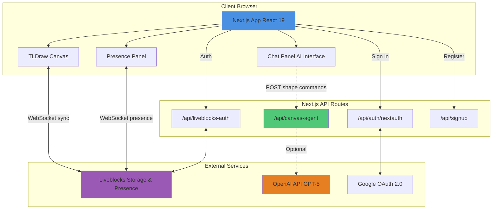

# 🌙 Moon Canvas

A real-time collaborative whiteboard application with AI-powered canvas manipulation. Built with Next.js 15, TLDraw 4, and Liveblocks, featuring an intelligent AI agent that understands natural language commands to create and transform shapes on the canvas.

## ✨ Features

- **Real-time Collaboration**: Multiple users can work together simultaneously with live cursors and presence indicators
- **AI Canvas Agent**: Natural language interface to manipulate shapes (powered by OpenAI GPT-5 with intelligent fallback heuristics)
- **Flexible Authentication**: Support for Google OAuth and local credential-based authentication
- **Professional Drawing Tools**: Full-featured TLDraw canvas with shapes, text, arrows, and more
- **Live Presence Panel**: See who's online and what they're working on
- **Persistent Storage**: Canvas state is automatically saved and synchronized via Liveblocks

## 🏗️ Architecture



### Data Flow

1. **Real-time Collaboration**: Canvas changes are synced through Liveblocks WebSocket connections, ensuring all users see updates instantly
2. **AI Commands**: User messages are sent to `/api/canvas-agent`, which processes them via OpenAI GPT-5 (or fallback heuristics) and returns shape manipulation commands via Server-Sent Events (SSE)
3. **Authentication**: NextAuth handles Google OAuth and credentials-based login, while Liveblocks manages room-level authorization
4. **Presence**: User cursors, selections, and online status are broadcast through Liveblocks presence system

## 🚀 Getting Started

### Prerequisites

- **Node.js** 18.17 or later
- **npm** or **pnpm** package manager
- **Liveblocks account** (free tier available at [liveblocks.io](https://liveblocks.io))
- **Google Cloud Console project** (for OAuth)
- **OpenAI API key** (optional, for AI agent)

### Installation

1. **Clone the repository**

```bash
git clone https://github.com/kennyu/moon-canvas.git
cd moon-canvas
```

2. **Install dependencies**

```bash
npm install
# or
pnpm install
```

3. **Set up environment variables**

Copy the example environment file and fill in your credentials:

```bash
cp .env.example .env
```

Edit `.env` and configure the following:

- `NEXTAUTH_SECRET`: Generate with `openssl rand -base64 32`
- `NEXTAUTH_URL`: `http://localhost:3000` for development
- `LIVEBLOCKS_SECRET_KEY`: From your [Liveblocks dashboard](https://liveblocks.io/dashboard)
- `GOOGLE_CLIENT_ID` & `GOOGLE_CLIENT_SECRET`: From [Google Cloud Console](https://console.cloud.google.com/)
- `OPENAI_API_KEY`: (Optional) From [OpenAI Platform](https://platform.openai.com/)

See `.env.example` for detailed setup instructions for each service.

4. **Run the development server**

```bash
npm run dev
```

Open [http://localhost:3000](http://localhost:3000) in your browser.

### Building for Production

```bash
npm run build
npm start
```

## 🎨 Using the AI Canvas Agent

The AI agent can manipulate canvas shapes through natural language. Here are some example commands:

- **Create shapes**: "create a blue circle", "add a rectangle with text 'Hello'"
- **Transform shapes**: "move it to the center", "rotate the selected shape 45 degrees"
- **Resize**: "make it twice as big", "resize to 300x200"
- **Layout**: "arrange in a row with 20px gap", "distribute vertically and center align"
- **Delete**: "delete the selected shapes"

The agent is context-aware and considers:
- Current viewport position and size
- Selected shapes
- All visible shapes on the canvas

**Note**: If `OPENAI_API_KEY` is not provided, the agent falls back to rule-based heuristics that handle common commands.

## 📁 Project Structure

```
moon-canvas/
├── src/
│   ├── app/                    # Next.js App Router
│   │   ├── api/                # API routes
│   │   │   ├── canvas-agent/   # AI agent endpoint
│   │   │   ├── liveblocks-auth/# Liveblocks authorization
│   │   │   ├── auth/           # NextAuth endpoints
│   │   │   └── signup/         # User registration
│   │   ├── auth/               # Auth page
│   │   ├── layout.tsx          # Root layout
│   │   ├── page.tsx            # Main canvas page
│   │   ├── Providers.tsx       # React context providers
│   │   └── Room.tsx            # Liveblocks room wrapper
│   ├── components/             # React components
│   │   ├── AuthBar.tsx         # Authentication UI
│   │   ├── ChatPanel.tsx       # AI chat interface
│   │   ├── PresencePanel.tsx   # Live user presence
│   │   ├── StorageTldraw.tsx   # TLDraw with Liveblocks
│   │   └── useStorageStore.ts  # Liveblocks storage hook
│   ├── agent/                  # AI agent parsers
│   │   └── client/             # Client-side command parsers
│   ├── lib/                    # Utility functions
│   └── liveblocks.config.ts    # Liveblocks type definitions
├── e2e/                        # Playwright E2E tests
├── plans/                      # Development plans
├── package.json
├── next.config.js
└── tsconfig.json
```

### Key Components

- **`StorageTldraw.tsx`**: Integrates TLDraw canvas with Liveblocks storage and presence
- **`ChatPanel.tsx`**: AI chat interface that processes commands via SSE stream
- **`useStorageStore.ts`**: Custom hook binding TLDraw store to Liveblocks LiveMap
- **`canvas-agent/route.ts`**: API endpoint handling AI command processing with OpenAI GPT-5 or heuristic fallback

## 🧪 Development

### Available Scripts

```bash
npm run dev          # Start development server
npm run build        # Build for production
npm start            # Start production server
npm run lint         # Run ESLint
npm run test:e2e     # Run Playwright E2E tests
```

### API Endpoints

- **`POST /api/canvas-agent`**: Process natural language canvas commands
  - Request: `{ message, viewportSize, visibleCenter, shapes[], selectionIds[] }`
  - Response: Server-Sent Events stream with shape manipulation commands

- **`POST /api/liveblocks-auth`**: Authenticate user for Liveblocks room access
  - Returns: Liveblocks session token

- **`GET/POST /api/auth/[...nextauth]`**: NextAuth authentication endpoints

- **`POST /api/signup`**: Create new user account with credentials

### Testing

Run end-to-end tests with Playwright:

```bash
npm run test:e2e
```

Tests include:
- Layout and distribution commands
- Transform operations (move, resize, rotate)
- Multi-user collaboration scenarios

## 🔧 Tech Stack

- **Framework**: [Next.js 15](https://nextjs.org/) with App Router
- **React**: [React 19](https://react.dev/)
- **Canvas**: [TLDraw 4](https://tldraw.dev/)
- **Real-time**: [Liveblocks](https://liveblocks.io/) (Storage + Presence)
- **Authentication**: [NextAuth.js v4](https://next-auth.js.org/)
- **AI**: [OpenAI API](https://platform.openai.com/) (GPT-5)
- **Validation**: [Zod](https://zod.dev/)
- **Testing**: [Playwright](https://playwright.dev/)
- **Styling**: CSS Modules
- **Language**: TypeScript

## 🔐 Authentication Setup

### Google OAuth

1. Go to [Google Cloud Console](https://console.cloud.google.com/)
2. Create a new project or select an existing one
3. Enable the Google+ API
4. Navigate to Credentials → Create Credentials → OAuth 2.0 Client ID
5. Add authorized redirect URI: `http://localhost:3000/api/auth/callback/google`
6. Copy Client ID and Client Secret to your `.env` file

### Local Credentials

Users can also sign up with email/password. User data is stored in-memory (for demo purposes). In production, replace with a proper database.

## 🌐 Deployment

### Environment Variables

Ensure all required environment variables are set in your deployment platform:

- `NEXTAUTH_SECRET`
- `NEXTAUTH_URL` (your production URL)
- `LIVEBLOCKS_SECRET_KEY`
- `GOOGLE_CLIENT_ID`
- `GOOGLE_CLIENT_SECRET`
- `OPENAI_API_KEY` (optional)

### Recommended Platforms

- **Vercel**: Optimized for Next.js (recommended)
- **Netlify**: Full Next.js support
- **Railway**: Easy deployment with environment management
- **Self-hosted**: Docker or Node.js server

## 📝 License

This project is licensed under the Apache License 2.0. See the LICENSE file for details.

## 🙏 Acknowledgments

- [TLDraw](https://tldraw.dev/) for the excellent canvas library
- [Liveblocks](https://liveblocks.io/) for real-time collaboration infrastructure
- [Next.js](https://nextjs.org/) team for the amazing framework
- [OpenAI](https://openai.com/) for powerful AI capabilities

## 📧 Support

For issues, questions, or contributions, please open an issue on [GitHub](https://github.com/kennyu/moon-canvas/issues).

---

Built with ❤️ using Next.js, TLDraw, and Liveblocks

